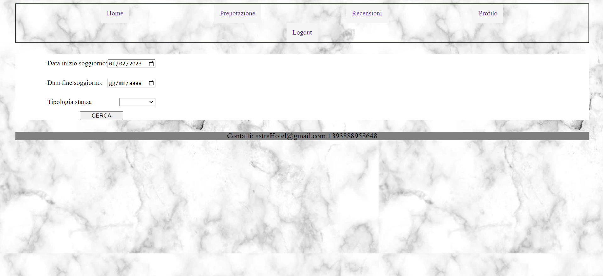
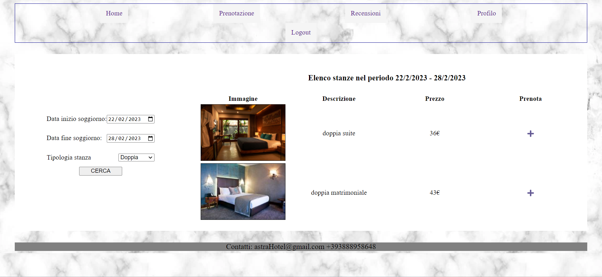
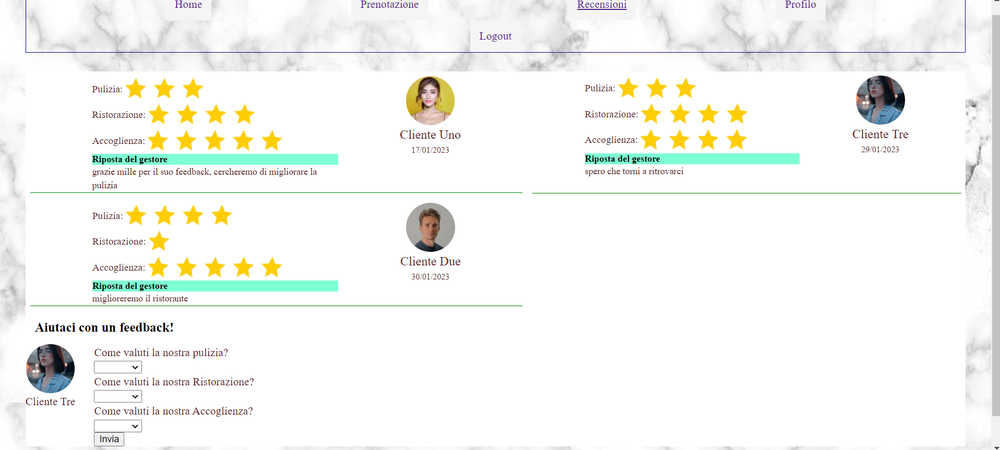
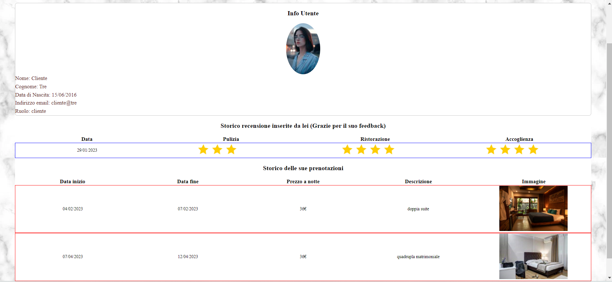
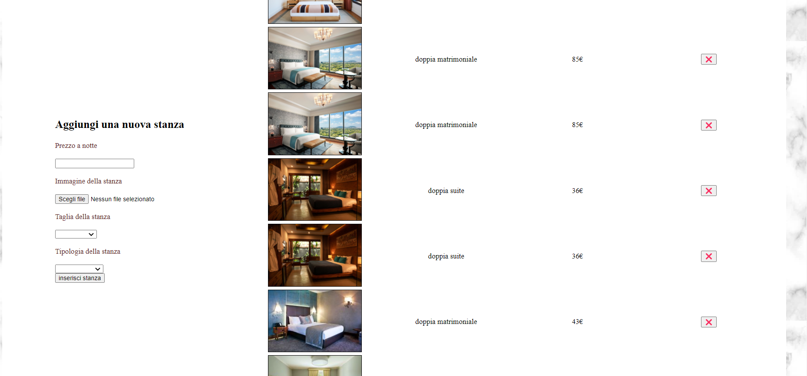
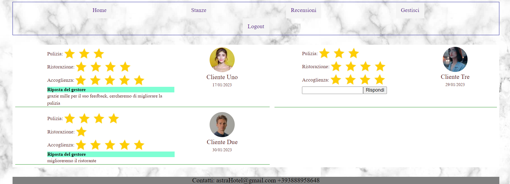

<a name="readme-top"></a>

<!-- PROJECT LOGO -->
<br />
<div align="center">
  <a href="https://github.com/brayanVaccaro/webProject">
    
  </a>

<h3 align="center">Astra</h3>

  <p align="center">
    Il sito dell'hotel Astra che si trova a Gallipoli, dove si possono prenotare stanze, scrivere recensioni e controllare il proprio profilo e vedere tutte le recensioni scritte e tutte le prenotazioni eseguite
    <br />
    <a href="https://github.com/brayanVaccaro/webProject"><strong>Documento: »</strong></a>
    <br />
    <br />
    ·
    ·
  </p>
</div>
</div>


<!-- TABLE OF CONTENTS -->
<details>
  <summary>Indice:</summary>
  <ol>
    <li>
      <a href="#about-the-project">Il progetto:</a>
    </li>
    <li>
      <a href="#getting-started">Per Iniziare:</a>
      <ul>
        <li><a href="#installation">Installazione:</a></li>
      </ul>
    </li>
    <li><a href="#usage">Utilizzo</a></li>
    <li><a href="#roadmap">Passaggi da seguire</a></li>
    <li><a href="#license">License</a></li>
    <li><a href="#contact">Contact</a></li>
  </ol>
</details>


<!-- IL PROGETTO -->
## Il progetto:
<br />
<div align="center">
  <a href="https://github.com/brayanVaccaro/webProject">
    
  </a>
  <p align="center">
</div>
L'obbiettivo del progetto è quello di implementare una applicazione web in grado di scambiare dati con un DataBase in un server dando la possibilità di insere e visualizzando prenotazioni di stanze, e inserendo e visualizzando recensioni scritti dai clienti


<p align="right">(<a href="#readme-top">back to top</a>)</p>


<!-- PER INIZIARE -->
### installazione

1. Clone the repo
   ```
   git clone https://github.com/brayanVaccaro/webProject.git
   ```
2. Fill .envtemplate with your custom variables. Rename it in .env
3. build it:
   ```
   npm i
   npm run dev
   ```

<p align="right">(<a href="#readme-top">back to top</a>)</p>


<!-- ESEMPI DI UTILIZZO -->
### Utenti Cliente
Per utilizzare il servizio eseguire il login, se invece non si ha un'utente eseguire la registrazione.
Senza eseguire la registrazione è possibile visualizzare la pagina Home e la pagina Recensioni, ma non è possibile inserirne una e la pagina di Login
Dopo aver Eseguito il login è possibile notare dei piccoli cambiamenti nella pagina di Home, ed è possibile andare nella pagina Prenotazione per eseguire una prenotazione.
<div align="center">
  <a href="https://github.com/brayanVaccaro/webProject">
    
  </a>
</div>
Selezionando la data dell'inizio del soggiorno, la data di fine del soggiorno e la tipologia stanza vengono visualizzate le stanze disponibili
<div align="center">
  <a href="https://github.com/brayanVaccaro/webProject">
    
  </a>
</div>
Premendo su prenota viene visualizzato il riepilogo della stanza scelta e premendo Conferma Prenotazione viene eseguita la prenotazione  

Andando nella pagina Recensioni è anche possibile eseguire una recensione ora che si è loggati (scegliendo la quantità di stelle che si vuole dare alla pulizia, ristorazione e accoglienza).
<div align="center">
  <a href="https://github.com/brayanVaccaro/webProject">
    
  </a>
</div>
 E infine andando nella pagina Profilo è posssibile visualizzare i dati inseriti durante la registrazione, lo storico delle recensioni e delle prenotazioni eseguite dal cliente.
 <div align="center">
  <a href="https://github.com/brayanVaccaro/webProject">
    
  </a>
</div>
<p align="right">(<a href="#readme-top">back to top</a>)</p>

### Utenti Gestore
Rispetto alla versione cliente la pagina Home non cambia molto, passando invece alla pagine Stanze si ha l'elenco delle stanze disponibili nel dataBase, ed è possibile attraverso il taso X di eliminarle e dall'interfaccia sulla sinistra è possibile aggiungere una nuova stanza.
 <div align="center">
  <a href="https://github.com/brayanVaccaro/webProject">
    
  </a>
</div>
Nella pagina Recensione invece è possibile oltre a visualizzare le recensioni, rispondere.
 <div align="center">
  <a href="https://github.com/brayanVaccaro/webProject">
    
  </a>
</div>
Infine nella pagina Gestisci è possibile è possibile oltre a visualizzare i dati del gestore visualizzare tutte le prenotazioni eseguite dai cliente
 <div align="center">
  <a href="https://github.com/brayanVaccaro/webProject">
    
  </a>
</div>

<!-- ROADMAP -->
## Roadmap
Caratteristiche obbligatorie:
- [x] Progettare il Mockup
- [x] Costruire il progetto Logico del DataBase
- [x] Costruire il DataBase e le istruzioni SQL
- [x] Implementare l'autenticazioni(Registrazione e Login) 
- [x] Implementare le prenotazioni delle stanze
- [x] Implementare le recensioni
- [x] Implementare la pagina profilo con lo storico
- [x] Implementare la parte del gestore  
- [x] Scrivere il CSS
- [x] Scrivere la relazione 


Caratteristiche opzionali:
- [x] login / logout tipo icona
- [ ] Calendario con colori che indicano la disponibilità o meno delle stanze 
- [ ] Calcolare il periodo di prenotazione totale 
- [ ] Calcolare il prezzo totale in base ai giorni
- [x] Risposta del gestore al cliente
- [x] Recensioni con le stelle al posto del testo

Per mancanza di tempo, alcune caratteristiche opzionali non sono state implementate. Vedremo di implementarle successivamente
<p align="right">(<a href="#readme-top">back to top</a>)</p>


<!-- LICENSE -->
## License

Distributed under the MIT License. See `LICENSE` for more information.

<p align="right">(<a href="#readme-top">back to top</a>)</p>


<!-- CONTACT -->
## Contact

Marawan Emad - marawan.emadragab@studio.unibo.it <br />

Brayan Vaccaro - brayan.vaccaro@studio.unibo.it <br />


Project Link: [https://github.com/brayanVaccaro/webProject](https://github.com/brayanVaccaro/webProject)

<p align="right">(<a href="#readme-top">back to top</a>)</p>

