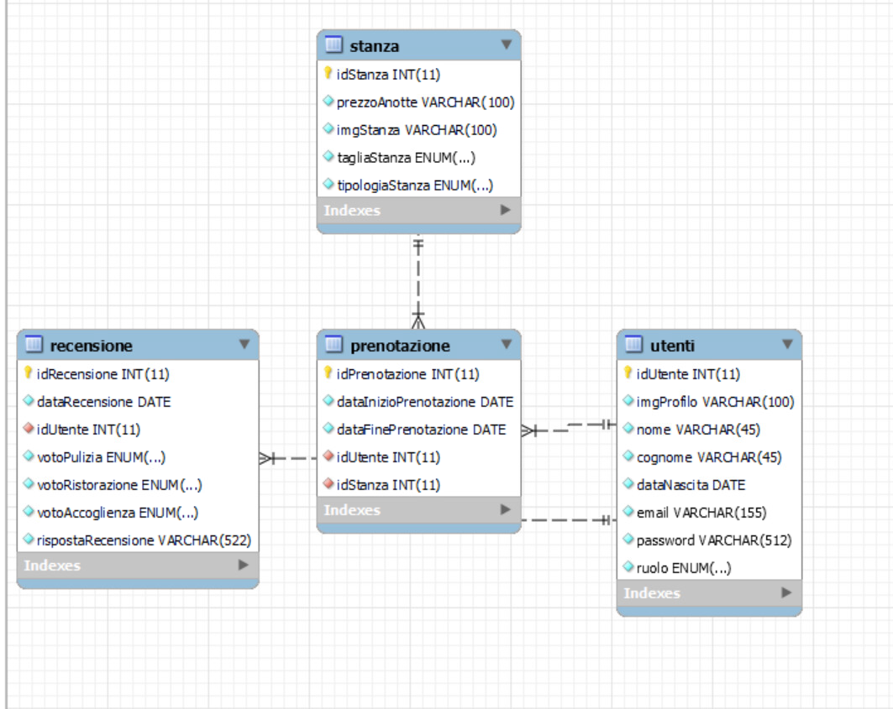

# Analisi
Il sito "Astra" è un'applicazione Web per rendere più semplice l'accesso all'hotel per tutti i clienti dandogli la possibilità di verificare se c'è disponibilità, prenotare stanze e visualizzare le recensioni di altri clienti. 
## Requisiti
- il gestore deve essere in grado di: 
  - aggiungere o rimuovere stanze dal dataBase 
  - rispondere alle recensioni dei clienti
  - eliminare prenotazioni 
- il cliente deve essere in grado di 
  - prenotare stanze scelgliendo il periodo di prenotazione 
  - scrivere una sola recensione per giorno
  - visualizzare lo storico delle sue recensioni inserite nella pagina profilo
  - visualizzare lo storico delle sue prenotazioni eseguite nella pagina profilo

## Progetto Logico
 

  

- Le difficoltà nel creare questo DataBase sono stati:: 
  - I vincoli:
    - per esempio per le recensioni abbiamo dovuto dare all'utente la possibilità di scrivere una recensione per giorno 
  - Le associazioni tra tabelle:
    - Abbiamo dovuto assocciare ogni prenotazione all'id della stanza prenotata e all'id dell'utente che la prenota 
    - E anche ogni recensione doveva essere assocciata all'id dell'utente che l'ha scritta 

## Architettura

L'applicazione Web sarà realizzata con il Nuxt (v3),sia la parte backend che frontend.
Lo stile verrà implementato con scss. Si seguirà un approccio Mobile-first nelle fasi del suo sviluppo.
Il mockup verrà progettato con Balsamiq.
I dati dell'applicazione verranno ospitati phpMyAdmin in locale.
Lo schema logico è disponibile nella repository del progetto.
Il codice HTML è stato validato utilizzando l'estensione SiteImprove di google chrom.

### Premessa: DB

Il Database è composto da 4 tabelle.
1. Utenti: che comprende la lista degli utenti (idUtente, imgProfilo, nome, cognome, dataNascita, email, password, ruolo)
    - La colonna ruolo indica i tipi di utenti che accedono all'applicazione: Cliente, Gestore
2. Stanza: che comprende la lista delle stanze (idStanza, prezzoAnotte, imgStanza, tagliaStanza, tipologiaStanza)
3. Recensione: che comprende i dati relativi alla valutazione che un utente(identificato attraverso l'associazione con la tabella Utente, attraverso l'idUtente)ha dato all'hotel(idRecensione, dataRecensione, idUtente, votoPulizia, votoRistorazione, votoAccoglienza, rispostaRicensione) 
4. Prenotazione: che comprende i dati relativi alle prenotazione che un utente(identificato attraverso l'associazione con la tabella Utente) ha eseguito e della stanza (identificata attraverso l'associazione con la tabella Stanza) prenotata(idPrenotazione, dataInizioPrenotazione, dataFinePrenotazione, idUtente, idStanza). 

### App
Il navbar cambia per in base agli utenti(anche per i non autenticati). Questo perchè ogni tasto è implementato con v-if/v-else che fanno vedere alcuni tasti solo da loggati, oppure da clienti rispetto o da gestori.
Il tasto Prenotazione per esempio per i gestori diventa Stanze, e Profilo per i gestori diventa gestisci.
Invece la Home, Login, Recensioni sono pagine che si vedono senza essere loggati.
A TUTTE LE PAGINE VIENE ESEGUITO IL CHECK ATTRAVERSO IL MIDDLEWARE REQUIRE-LOGIN.

### Login

Il form di login è visibile solo se l'utente non è già loggato, il check viene effettuato dal middleware requireLogout.
Attraverso il form vengono raccolti i dati dell'utente e poi si usa un fetch con il metodo POST per inviarli all'API di login. E infine i dati vengono autenticati attraverso JWT, che verifica che le credenziali siano corrette e se lo sono viene restituito un cookie con il token di autenticazione.

### Registrazione

In caso di cliente senza un'utente si deve eseguire la registrazione per accedere all'applicazione web.
Il form raccoglie nome, cognome, email, password, data di nascita dell'utente e poi usa sempre un fetch con il metodo POST per inviarli all'API di register.

### Prenotazione/Stanze

Pagina visibile e accessibile solo dopo aver effettuato l'autenticazione il login, 
la pagina sfrutta una query che chiede al DB di recuperare tramite select tutte le stanze registrate nella tabella Stanza, che però sono libere nel periodo scelto dall'utente attraverso gli input tag.
Quando viene cliccato prenota viene creato un riepilogo della prenotazione per confermarla al click di Conferma prenotazione viene eseguita una fetch che esegue attraverso un Insert into la tabella stanza una query che inserisce la prenotazione all'interno della tabella prenotazione.
Invece per il gestore questa pagina diventa Stanze e contiene la lista delle stanze(libere o meno) ed è possibile attraverso il tasto X (che esegue una fetch che usa una query sql Delete From tabella stanza)eseguire l'eliminazione dal dataBase della stanza selezionata. E sulla sinistra si trova un'interfaccia grafica da cui si può aggiungere una stanza, attraverso l'inserimento dei dati della stanza e premendo il tasto inserisci stannza(che esegue una fetch che usa una query sql Insert Into la tabella stanza)

### Recensione

Pagina visibile e accessibile solo dopo aver effettuato l'autenticazione il login, e contiene le recensioni inserite dagli utenti e le risposte inserite dai gestori, e solo per i clienti un'interfaccia grafica da qui si può aggiungere una recensione inserendo i voti che diventano stelline e premendo il tasto invia (che esegue una fetch che usa una query sql Inserto Into della tabella recensione)
Per i gestori invece viene visualizzato SOLO per le recensioni senza risposta un tag input e il tasto rispondi che premuto esegue una fetch che usa una query sql Update alla tabella recensione, specificatamente alla recensione selezionata.   

#### Profilo/Gestisci

Pagina visibile e accessibile solo dopo aver effettuato l'autenticazione il login, e contiene i dati dell'utente che vengono inseriti alla registrazione(visualizzati grazie ad una fetch che usa una query sql Select dalla tabella utenti), lo storico delle recensioni inserite dall'utente loggato(visualizzati grazie ad una fetch che usa una query sql Select dalla tabella recensioni) e lo storico delle prenotazioni eseguite dall'utente loggato(visualizzati grazie ad una fetch che usa una query sql Select dalla tabella prenotazioni).
Per i gestori invece la pagina diventa Gestisci e oltre ai dati è possibile visualizzare lo storico di tutte le prenotazioni eseguite da tutti i clienti(visualizzabile grazie ad una fetch che usa una query sql Select dalla tabella prenotazione), con all'interno i dati della stanza, quelli dell'utente e le date di inizio/fine di prenotazione e un bottone di Elimina prenotazione che esegue una fetch che usa una query sql Delte dalla tabella prenotazione

# Guida utente

See README.md
